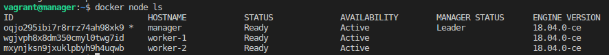
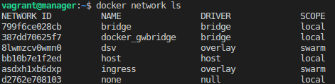
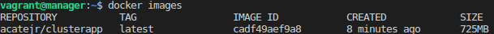
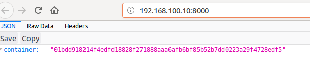
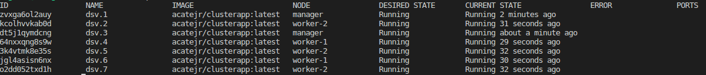
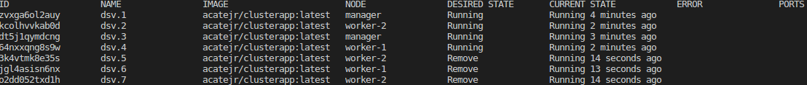
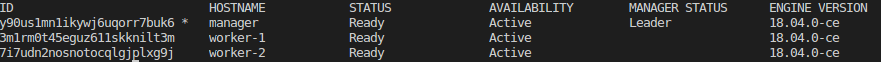
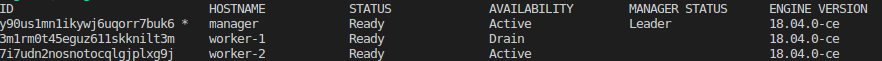
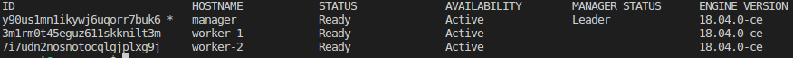

# Cluster Project

This cluster project is being used to develop a 3-node Docker Swarm cluster.  The cluster may be re-used in the class project, time permitting.  The cluster 
built in this project is based on the work down by [Monica Gangwar](https://github.com/monicagangwar).  She created an [excellent example](https://github.com/monicagangwar/docker-swarm-vagrant) of how to use Vagrant and Docker to create a Docker swarm.  The entirety of this cluster project is based 
on her example.

## Resources

The following requirements are left to the user to install and configure.  
* [VirtualBox](https://www.virtualbox.org/)  
* [Docker](https://www.docker.com)  
* [Vagrant](https://www.vagrantup.com/)  

The docker image constucted in this example is stored in [Docker Hub](https://hub.docker.com/).  This cluster relies on pushing images to Docker Hub.  Instructions for pushing images can be found [here](https://docs.docker.com/docker-cloud/builds/push-images/).  

## The Cluster
A 3-node cluster can be constructed by completing the following steps.  The cluster will have 1 manager node and 2 worker nodes.  The cluster will also have  simple 
python based web application.  The cluster will host the web application and the web application can be accessed by running the cluster and browsing to the cluster's 
internal network IP address.

1. Obtain a copy of all of the files and folders associated with this project.  You will need:  

    ```
    Dockerfile  
    Vagantfile  
    app/  
    ```

1. Using the command console or termianl, navigate to the folder containing this project's files.

2. Build the application's docker image.  

    ```
    docker build -t acatejr/clusterapp .
    ```  
    acatejr/clusterapp is the Docker image name.  Change the "acatejr" part of the image name to suit your needs (e.g., your user name on Docker Hub).

3. Use Vagrant to build the cluster.  

    ```
    vagrant up
    ```
    This may require some time to finish.  

5. Initialize the swarm.  

    ```
    vagrant ssh manager
    docker swarm init --advertise-addr 192.168.100.10:2377
    ```
    
    Copy the join messge from docker.  

    ```
    exit
    ```  
    
    Use the join message in the worker nodes to let the workers join the swarm.  Your message token will be different than the example.  

    ```
    vagrant ssh worker-1
    docker swarm join --token SWMTKN-1-34h4qdpln8ghhoh9rsiebngylsnb2wglf6wly8q4ffucv2hx86-31nq8o84k4cby45wfjqx3xylo 192.168.100.10:2377
    exit

    vagrant ssh worker-2
    docker swarm join --token SWMTKN-1-34h4qdpln8ghhoh9rsiebngylsnb2wglf6wly8q4ffucv2hx86-31nq8o84k4cby45wfjqx3xylo 192.168.100.10:2377
    exit
    ```  

6. Examine the swarm nodes to make sure the swarm is running.  

    ```
    vagrant ssh manager
    docker node ls
    ```  

    

7. Create network for the swarm.  

    You should still be in a vagrant ssh manager session.  

    ```
    docker network create -d overlay dsv
    ```  
    
    Confirm the network.  

    ```
    docker network ls  
    ```  

    

8. Create the web application's service.  

    Get the image name.  
    ```
    docker images
    ```  
    

    Start the web application service.  

    ```
    vagrant ssh manager

    docker service create --name dsv --network dsv -p 8000:8000 acatejr/clusterapp
    ```  

    You can now open a browser and access http://192.168.100.10:8000  

    

    If you repeat browser requests to the service you should see a different container id as the JSON response.  
    
9. Let's interact with the cluster.  

    You should still be in a vagrant ssh manager session.  
    
    Scale the cluster up:

    ```
    docker service update --replicas 7 dsv

    ```  
    Take a look.  
    ```
    docker service ps dsv
    ```  
      

    Scale the cluster down from 7 to 4.  

    ```
    docker service update --replicas 4 dsv    
    ```  
    Take a look.  
    
    ```
    docker service ps dsv
    ```  
      
    
    Take a node off-line.  

    ```
    docker node ls # To get a list of nodes
    ```  
    

    ```
    docker node update --availability drain 3m1rm0t45eguz611skknilt3m
    ```  

    Take a look.  

    ```
    docker node ls
    ```  
    

    Bring a drained node backup.  

    ```
    docker node update --availability active 3m1rm0t45eguz611skknilt3m
    ```  

    Take a look.  

    ```
    docker node ls
    ```  
    

That is a working demo of a python web application running on a 3-node docker swarm cluster.  

Mind blown!  
  
